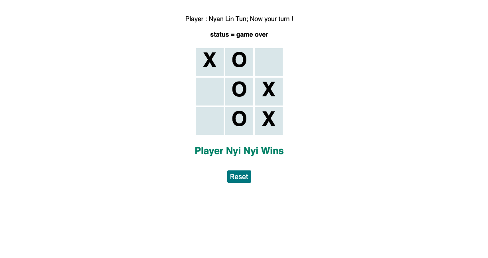

 
  <h3 align="center">Tic Tac Toe Game Project</h3>

  

    Myanmar Food & Restaurant Template Design and Practice Tab Logic with Javascript DOM.
     
     
    <a href="https://hungry-payne-9abdca.netlify.app/">View Demo</a>
  

# Tic-Tac-Toe Porject

> A basic tic tac toe game build with html css and javascript using modules.

## Built With

- Bootstrap 4
- HTML
- JavaScript

## Live Demo

[Live](https://hungry-payne-9abdca.netlify.app/)

## Getting Started

To get a local copy up and running follow these simple example steps.

### Prerequisites

Download the project

    $ git clone https://github.com/gitnyasha/tic-tac-toe-javascript.git

### Usage

We’re making a Tic Tac Toe game you can play in your browser!

- Open **index.html** file with your favorite browser. It's inside the project's root directory.

## Authors

👤 **Ko Nyan**

- Github: [konyan](https://github.com/konyan)
- Twitter: [@konyan](https://twitter.com/devkonyan)
- Linkedin: [nyanlintun](https://www.linkedin.com/in/nyanlintun/)

👤 **Marshall Nyasha Chikari**

- Github [GitHub](https://github.com/gitnyasha)
- Twitter: [@marshallchikari](https://twitter.com/marshallchikari)
- Linkedin: [marshall-chikari](https://linkedin.com/in/marshall-chikari-27532113a/)

## Show your support

Give a ⭐️ if you like this project!

## 📝 License

This project is [MIT]() licensed.
